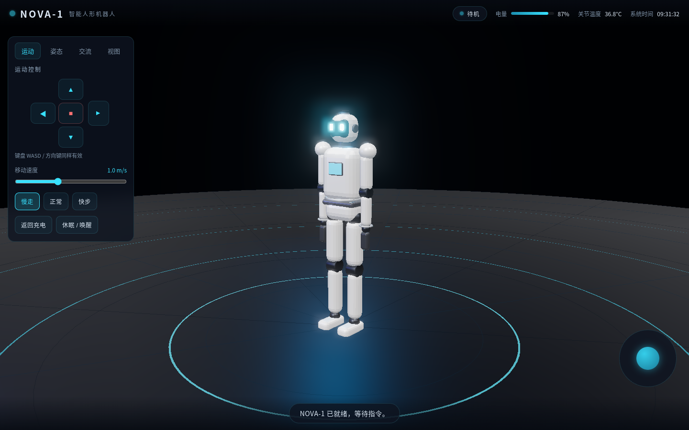

# NOVA-1 · 智能人形机器人 Web3D 交互平台

一款可直接在浏览器中运行的高端机器人数字孪生演示项目。机器人外观参考当前国内外先进人形机器人设计语言：修长的白色哑光外壳、隐藏式关节、胸口状态屏、头顶激光雷达模块与发光眼神，整体呈现科技感和未来感。



## 已实现功能

| 模块 | 说明 |
|------|------|
| 运动控制 | WASD / 方向键 / 屏幕方向键 / 虚拟摇杆控制前进、后退、转向；三种步态切换 |
| 姿态动作 | 挥手、鞠躬、握手、舞蹈、复位，基于程序化关节动画 |
| 人机交流 | 输入文字后机器人进入「倾听 → 思考 → 回答」流程，胸口屏幕同步显示表情与文本 |
| 结构视图 | 爆炸拆解滑块、外壳 X-Ray 透视、激光雷达扫描、摄像头视锥可视化 |
| 状态系统 | 待机 / 行走 / 交流中 / 充电中 / 休眠，电量与关节温度实时变化 |
| 自动演示 | 一键播放预设动作序列 |
| 后期效果 | UnrealBloom 辉光、RoomEnvironment 反射、阴影与雾效 |

## 技术栈

- **建模**：Blender 4.2 + Python 脚本（`blender/robot_modeling.py`）
- **导出**：`.blend` → `.glb`（带骨骼关节）
- **Web3D**：Three.js + Vite + EffectComposer（Bloom / OutputPass）
- **部署**：纯静态前端，无需后端

## 文件结构

```
robot-web3d/
├── blender/
│   ├── robot_modeling.py      # Blender 建模脚本，可重新生成机器人
│   └── robot.blend            # Blender 源文件
├── public/models/robot.glb    # 导出的 Web3D 模型
├── src/
│   ├── main.js                # 场景、灯光、渲染主循环
│   ├── robot.js               # 机器人状态机与关节动画
│   ├── ui.js                  # 面板、摇杆、键盘、对话逻辑
│   ├── face.js                # 胸口屏幕 CanvasTexture
│   ├── effects.js             # 激光雷达、视锥、音效
│   └── style.css              # HUD / 面板 / 赛博科技风格
├── screenshots/               # 关键交互效果截图
├── index.html
├── package.json
└── vite.config.js
```

## 本地运行

```bash
cd robot-web3d
npm install
npm run dev
# 打开 http://localhost:5173
```

## 重新生成 Blender 模型

在 Blender 中打开 `blender/robot_modeling.py`，粘贴到「脚本」编辑器并运行，即可生成完整的 NOVA-1 机器人、骨骼与材质。随后通过 Blender 导出为 `public/models/robot.glb`。

## 截图预览

- `01_idle.png` 待机状态
- `02_wave.png` 挥手致意
- `03_walk.png` 行走中
- `04_explode.png` 爆炸拆解
- `05_xray_lidar.png` 透视 + 激光雷达 + 视锥
- `06_talk.png` 人机对话
- `07_dance.png` 舞蹈动作
- `08_charge.png` 充电姿态

## 许可

本项目为学习/演示用途生成，模型与代码可自由修改使用。
